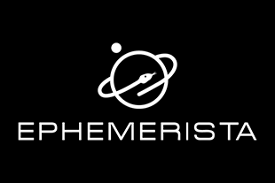

# Lox – Oxidized Astrodynamics

### A safe, ergonomic astrodynamics library for the modern space industry

  

> **Note:** Lox is under active development and does not yet have a stable release. The API of all crates is subject to
> significant change.

## Features

Lox exposes a comprehensive astrodynamics API at varying levels of granularity. The high-level interface offered
by `lox-space` is designed specifically for mission planning and analysis, while crates like `lox-time`, `lox-earth`
and `lox-coords` provide tools for advanced users and scientific computing.

* A fully featured space mission simulator backend.
* Python bindings for easy integration with industry standard tools.
* Tools for working with time in UTC, TAI, UT1, TT, TCB, TCG and TDB, in wall clock, Julian and high-precision
  representations.
* An RF communication toolkit.
* Work with fixed and rotating frames in Cartesian and Keplerian coordinate systems.
* Ephemeris, size and shape data for all major celestial bodies.
* Ingest and interpolate Earth orientation parameters with ease.
* Extensible – bring your own time scales, transformation algorithms, data sources and more.

## Crates

### lox-space

The entrypoint to the Lox ecosystem, suitable for most use cases. Provides a high-level interface for mission planning
and analysis. Also includes Lox's Python bindings.

### lox-time

Tools for working in all modern astronomical time scales, including wall clock, Julian and high-precision
representations. Offers leap-second aware conversion from UTC to continuous time scales.

### lox-bodies

Provides structs representing all major celestial bodies, conveniently categorized by a variety of traits exposing
SPICE-dervied data.

### lox-comms

Tools for planning and analysing RF communication links between spacecraft and ground stations.

### lox-coords

Tools for working with fixed and inertial coordinate systems, including transformations between them.

### lox-earth

Essential algorithms for Earth-centric astrodynamics, including nutation-precession models, Earth rotation angle, CIP
and CIO locations, and coordinate transformations.

### lox-eop

A dedicated crate for ingesting and interpolating Earth orientation parameters.

### lox-ephem

Parses ephemeris data from external sources.

### lox-io

Utilities for reading and writing data in various formats.

### lox-utils

A collection of utilities used across the Lox ecosystem.

## Used by...

### Ephemerista

A next-generation, open-source space mission simulator commissioned by the European Space Agency.